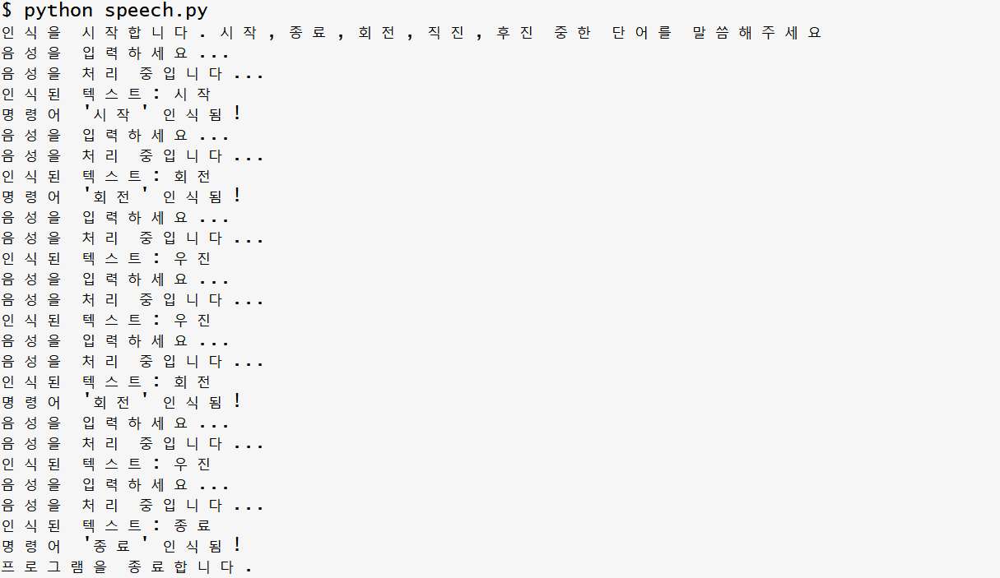

# simple-speech
간단한 음성 인식 

ChatGPT로 만든 간단한 음성인식 앱. 
```
간단한 음성 인식 코드를 만들어줘. 컴퓨터 마이크로 음성을 입력 받고 다음 단어들을 인식해 줘.

시작, 종료, 회전, 직진, 후진.
```

* [ChatGPT prompt](https://chatgpt.com/share/677db95c-fc44-8003-87b8-3e6cb551f4e4)
* Minor edits: flush print statemnt ; initial message

실행 방법:
* `pip install SpeechRecognition pyaudio`
* `python speech.py` 

실행 결과 예제: "후진"을 "우진"으로 오인식하네요.


